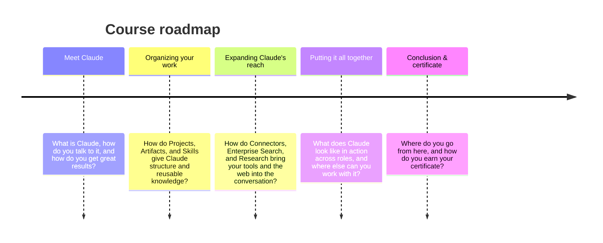

# Learning objectives

By the end of this lesson you'll be able to:

- Explain what Claude is and the principles that guide its design
- Describe Claude's core capabilities and how it differs from a simple chatbot
- Identify the different ways to access Claude (web, desktop, and mobile)

## Course roadmap

## Cos'è Claude?

(10 minuti)

Claude è più di un chatbot: è un assistente IA progettato per essere il tuo partner di pensiero. In questa lezione scoprirai cosa rende Claude diverso dagli altri strumenti di IA e vedrai come può aiutarti in un'ampia varietà di attività lavorative.

### Punti chiave

- **Claude è costruito per essere utile, innocuo e onesto:** a livello generale, Claude è guidato da principi che lo aiutano a evitare risposte tossiche o discriminatorie, evitare di assistere le persone in attività illegali o non etiche e, nel complesso, a comportarsi come un sistema IA utile, onesto e innocuo. Questo approccio, chiamato *Constitutional AI*, significa che Claude è addestrato per allinearsi ai valori umani e operare in modo trasparente.
- **Claude è più di un chatbot:** Claude è in grado di svolgere un'ampia varietà di compiti conversazionali e di elaborazione del testo mantenendo un alto grado di affidabilità e prevedibilità, inclusi riassunti, ricerca, scrittura creativa e collaborativa, Q&A, programmazione e altro. Pensa a Claude come a un compagno di ragionamento che può aiutarti ad affrontare problemi complessi e superare situazioni difficili, non solo a rispondere a semplici domande.
- **Claude è progettato per essere indirizzabile e collaborativo:** Claude può seguire indicazioni su personalità, tono e comportamento. Gli utenti segnalano che Claude ha molte meno probabilità di produrre output dannosi, è più facile conversare con lui ed è più "guidabile", consentendoti di ottenere il risultato desiderato con meno sforzo.
- **Puoi accedere a Claude ovunque lavori:** le app di Claude sono disponibili per tutti i piani (Free, Pro, Max, Team ed Enterprise). Le tue conversazioni, i progetti, la memoria e le preferenze si sincronizzano su tutti i dispositivi quando effettui l'accesso. Che tu sia alla scrivania o in movimento, Claude è disponibile tramite web, app desktop e mobile.

### Comprendere le capacità di Claude

Claude può aiutarti in un'ampia gamma di attività che vanno ben oltre le semplici interazioni a botta e risposta, arrivando a una vera collaborazione da assistente in grado di automatizzare e migliorare il tuo lavoro. Ecco alcune aree in cui Claude eccelle:

- **Scrittura e creazione di contenuti:** Claude può collaborare con te su post per i social media, email professionali e report complessi. Poiché Claude è addestrato per seguire direttive su personalità e tono, potete iterare insieme sulla struttura e sulla chiarezza finché la tua voce non emerge in modo cristallino.
- **Ricerca e analisi:** Claude ti aiuta a esplorare prospettive di ricerca, compilare risultati e analizzare dati per far emergere insight significativi. Puoi caricare documenti e Claude ti aiuterà a dare un senso a informazioni complesse. Questo è reso possibile dall'ampia finestra di contesto, in grado di assimilare oltre 200.000 token (circa 500 pagine di testo o più), con un massimo di 1 milione di token sui piani Pro, Max, Team ed Enterprise usando Opus 4.7. Ciò permette a Claude di considerare un'enorme mole di materiali in una singola conversazione.
- **Assistenza alla programmazione (coding):** Claude Opus 4.7 è il nostro modello più potente finora e il miglior modello al mondo per la programmazione. Queste eccellenti prestazioni su compiti reali di coding significano che Claude può aiutarti a scrivere, eseguire il debug e spiegare il codice in diversi linguaggi di programmazione.
- **Risoluzione di problemi e ragionamento:** Claude gestisce complessi compiti cognitivi, problemi matematici, pensiero e analisi strategica e ricerca. Claude Opus 4.7 e Sonnet 4.7 sono modelli ibridi che offrono due modalità: risposte quasi istantanee e pensiero esteso (*Extended thinking*) per un ragionamento più profondo. Questa funzionalità permette a Claude di affrontare i problemi passo dopo passo, rendendolo particolarmente adatto a compiti che richiedono un'attenta analisi.
- **Imparare cose nuove:** che tu stia imparando una nuova competenza, esplorando campi a te non familiari o affrontando sfide complesse, Claude può adattarsi al tuo stile e al tuo ritmo di apprendimento. La *Learning mode* (modalità di apprendimento) è una nuova esperienza che guida il tuo processo di ragionamento invece di darti semplicemente le risposte, aiutandoti a sviluppare il pensiero critico.

Lasciati ispirare su come usare Claude nel tuo ruolo specifico esplorando la nostra galleria di casi d'uso su claude.com. Per approfondire cosa l'IA può (e non può) fare, consulta il nostro corso sulle Capacità dell'IA.

### Modi per accedere a Claude

Claude è l'intelligenza: l'assistente IA con cui stai imparando a lavorare in questo corso. Questa stessa intelligenza è disponibile attraverso interfacce diverse, ciascuna adatta a tipologie diverse di compiti.

- **Claude.ai** (e le relative app mobile e desktop) è il modo principale con cui la maggior parte delle persone interagisce con Claude. Qui puoi fare domande, brainstorming di idee, creare e modificare documenti e molto altro. Claude.ai è ideale per conversazioni, assistenza alla scrittura, ricerca, analisi e creazione di file. Questo è il focus principale del corso.
- **Claude Code** è uno strumento di coding "agente" progettato per sviluppatori, ma utilizzabile per manipolare qualsiasi tipo di file sul tuo computer. Claude Code può modificare direttamente i file, eseguire comandi e creare commit.
- **Claude e Slack** portano Claude direttamente nello strumento di comunicazione del tuo team. Puoi chattare con Claude nell'intestazione dell'assistente IA da qualsiasi canale o conversazione, oppure menzionando `@Claude` nei thread. Se connetti Slack a Claude, questo cercherà nei canali del workspace, nei messaggi diretti e nei file condivisi per trovare il contesto necessario a fornirti risposte e ricerche migliori.
- **Claude per Excel** ti consente di lavorare direttamente con Claude da una barra laterale in Microsoft Excel, dove può leggere, analizzare, modificare e creare nuove cartelle di lavoro. È ottimo per l'analisi di modelli, l'aggiornamento di ipotesi, il debug degli errori, la compilazione di template, la spiegazione di formule e la navigazione in fogli multipli.

Questo corso si concentrerà principalmente su Claude.ai, ma puoi dare un'occhiata anche a "Claude Code in Action" per maggiori informazioni sull'utilizzo di Claude nei flussi di sviluppo software.

## Riflessione sulla lezione

Quali compiti nel tuo lavoro attuale trarrebbero vantaggio dall'avere Claude come partner di ragionamento? Dai un'occhiata al tuo calendario (o meglio ancora, chiedi a Claude di farlo) e individua alcune attività per le quali potresti farti supportare dall'IA.